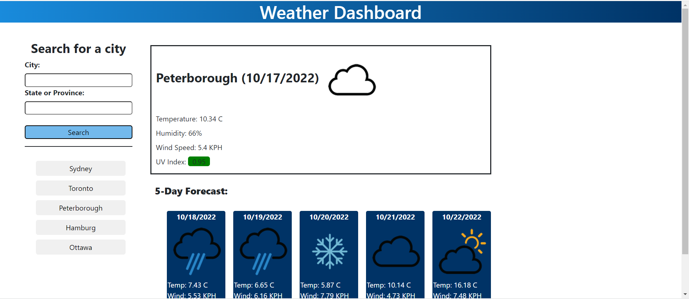

# Server-Side APIs  

## weather-app - Module 6  

A weather app that allows the user to search for a city and have the weather displayed currently and for the next 5 days.
The app saves your search history and allows you to use that history as buttons for future searches.  

Deployed Page: https://tarajevans.github.io/weather-app/  

Github Repo:https://github.com/tarajevans/weather-app  

 

User Story  

AS A traveler 
I WANT to see the weather outlook for multiple cities 
SO THAT I can plan a trip accordingly  

Acceptance Criteria  

GIVEN a weather dashboard with form inputs 
WHEN I search for a city 
THEN I am presented with current and future conditions for that city and that city is added to the search history 
WHEN I view current weather conditions for that city 
THEN I am presented with the city name, the date, an icon representation of weather conditions, the temperature, the humidity, and the wind speed 
WHEN I view future weather conditions for that city 
THEN I am presented with a 5-day forecast that displays the date, an icon representation of weather conditions, the temperature, the wind speed, and the humidity 
WHEN I click on a city in the search history 
THEN I am again presented with current and future conditions for that city
